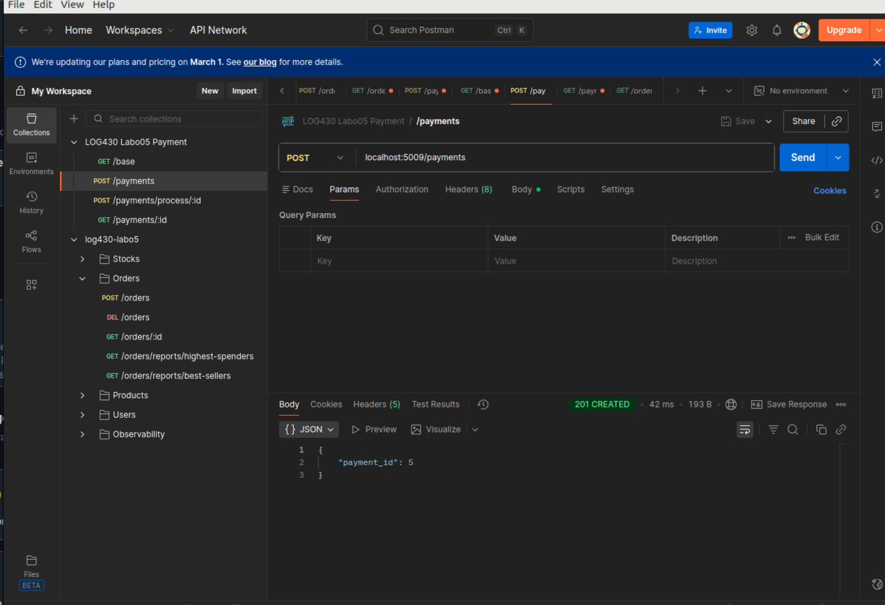
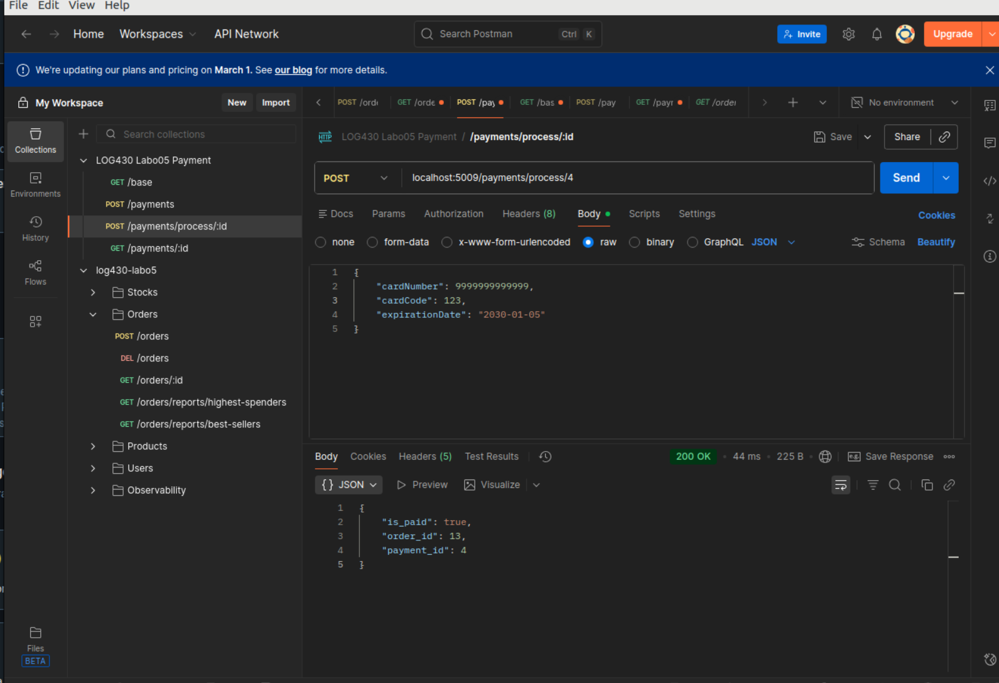
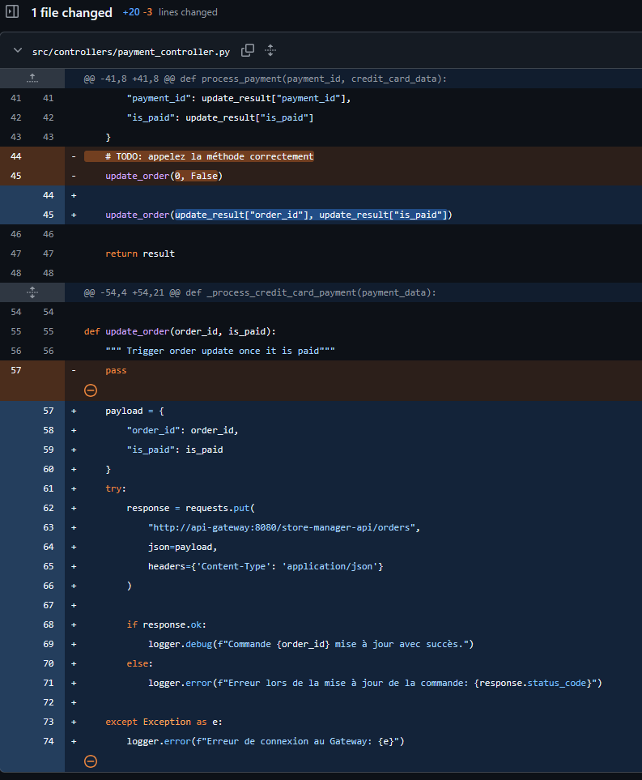
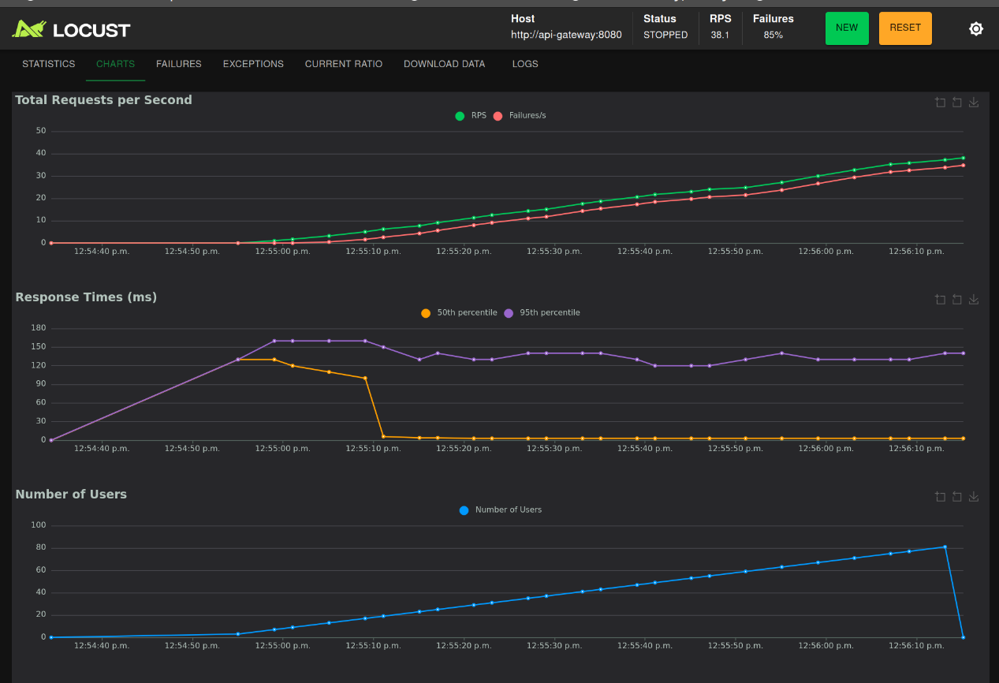
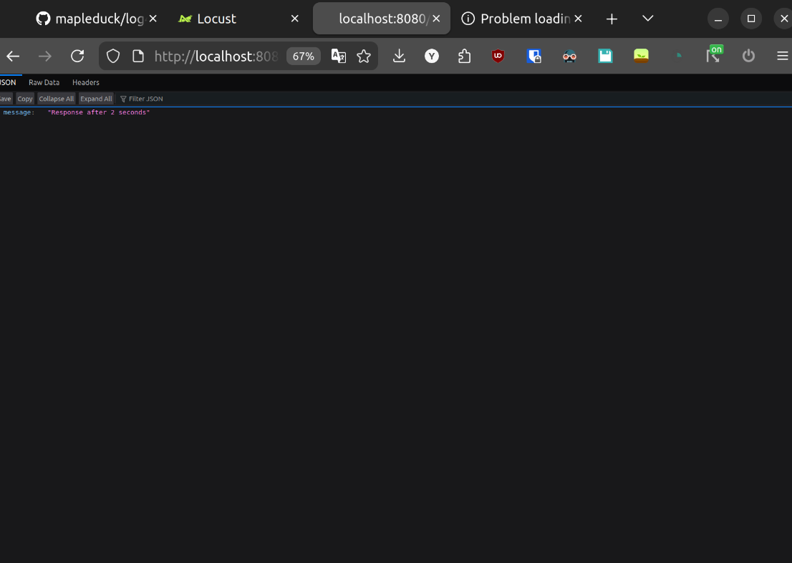
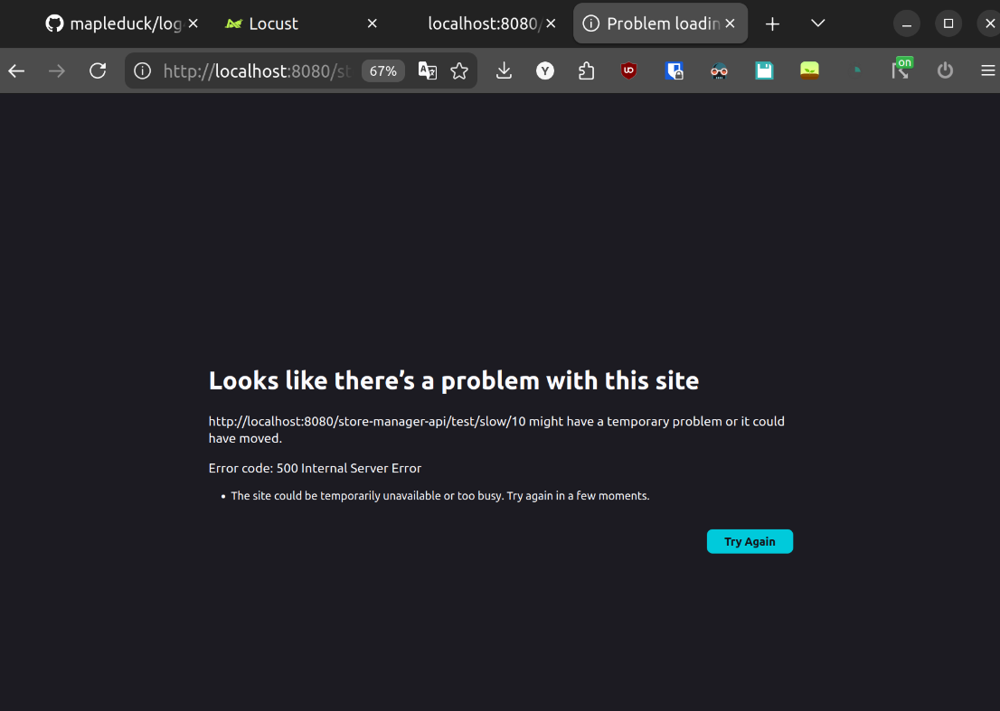
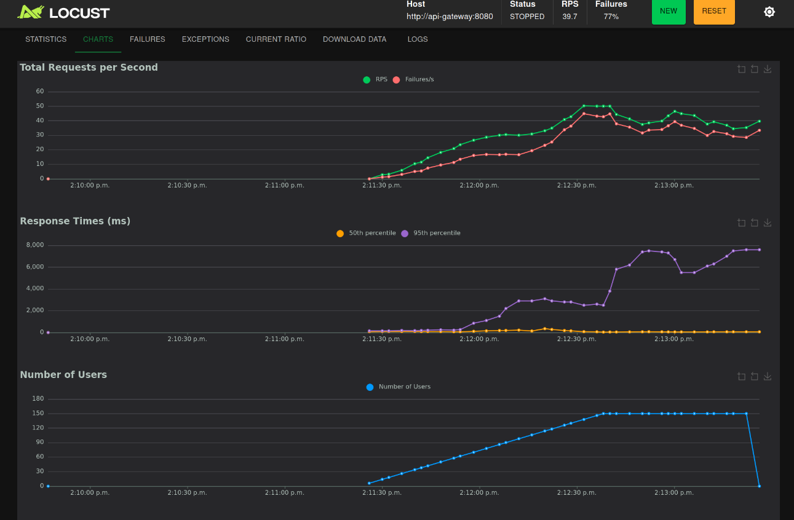
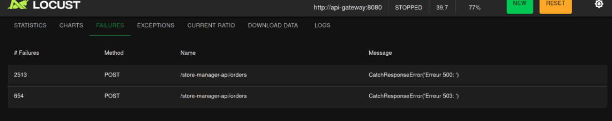
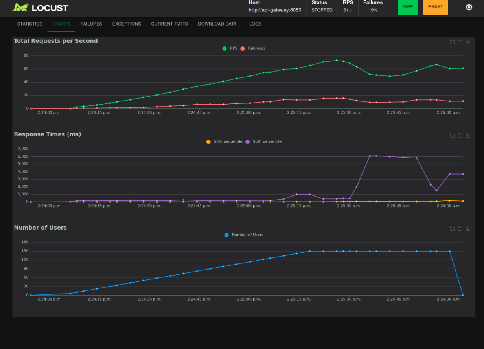
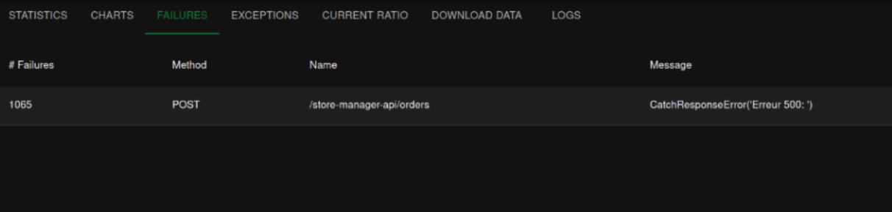

# LOG430 - Rapport du laboratoire 02
ÉTS - LOG430 - Architecture logicielle - Hiver 2026 - Groupe 1

Étudiant: Yanni Haddar
Nom github: mapleduck
repo github: https://github.com/mapleduck/log430-labo5 et https://github.com/mapleduck/log430-labo5-payment

## Questions

> 💡 Question 1 : Quelle réponse obtenons-nous à la requête à POST /payments ? Illustrez votre réponse avec des captures d'écran/du terminal.

Le body de la requête spécifie manuellement l'existence d'un order, et nous devrions donc recevoir un id de paiement pour pouvoir le process:
```
{
    "user_id": 1,
    "order_id": 1,
    "total_amount": 99.53
}
```
Nous recevont tout simplement un ID de payment. Ce test a été fait après 4 tentatives de payment process (j'ai pris trop d'avance par rapport à l'activité), il s'agit simplement de l'incrémentation normale:
<div style="text-align: center;">
  
</div>

> 💡 Question 2 : Quel type d'information envoyons-nous dans la requête à POST payments/process/:id ? Est-ce que ce serait le même format si on communiquait avec un service SOA, par exemple ? Illustrez votre réponse avec des exemples et captures d'écran/terminal.

Nous envoyons en JSON des informations de paiement d'une carte de crédit:
<div style="text-align: center;">
  
</div>

En SOA, ces informations seraient dans un format plus strict, en XML, avec des Enveloppes SOAP et un format tr's spécifique (il faut respecter un fichier WSDL).

> 💡 Question 3 : Quel résultat obtenons-nous de la requête à POST payments/process/:id?

On peut voir dans l'image ci-haut que l'API réponds avec l'order ID, le payment ID, et la confirmation que l'order a été marqué comme payé (is_paid = true).

> 💡 Question 4 : Quelle méthode avez-vous dû modifier dans log430-labo05-payment et qu'avez-vous modifiée ? Justifiez avec un extrait de code.

La méthode `update_order` dans `payment_controller.py` est celle qui a dû être modifiée (l'implémentation de la méthode devait être faite). En gros, la méthode fait un call à l'API pour mettre à jour la commande et le fait qu'elle a été payée. Il a aussi fallu adapter le call de update_order plus haut dans le fichier:
<div style="text-align: center;">
  
</div>

> 💡 Question 5 : À partir de combien de requêtes par minute observez-vous les erreurs 503 ? Justifiez avec des captures d'écran de Locust.

À partir de 6 requêtes par seconde.
<div style="text-align: center;">
  
</div>

> 💡 Question 6 : Que se passe-t-il dans le navigateur quand vous faites une requête avec un délai supérieur au timeout configuré (5 secondes) ? Quelle est l'importance du timeout dans une architecture de microservices ? Justifiez votre réponse avec des exemples pratiques.

Voici la requête de secondes, elle fonctionne comme prévu et renvoie ceci après 2 secondes:
<div style="text-align: center;">
  
</div>

La requête de 10 secondes n'a jamais complétée. Le navigateur indique une erreur 500 après 5 secondes exactement.
<div style="text-align: center;">
  
</div>

Le timeout agit comme une protection qui empêche un service lent de causer un effet snowball, ou le service monopolise les ressources, causant d'autres services de aussi ralentir. En forcant un échec rapide, on protège la stabilité et la disponibilité de tout le système et on évite que la panne se propage. Ceci est d'une grande importance dans l'architecture microservice.

## Test de charge (activité 7)
Les tests de charge ont été effectués sur 120s avec 150 users peak et un spawn rate de 2 users par seconde. Les tests ont été effectués sur ma machine dû à un problème de connexion au réseau de l'école, que je règlerai d'ici le prochain labo.

### Tentative #1 avec les paramètres par défaut, en faisant un POST sur les orders (voir locustfile ligne 37).
Très rapidement, un taux énorme d'erreur (>90%) a été atteint, quasiment que des erreurs 503. En regardant la console docker de KrakenD, le problème est évident:
```
[GIN] 2026/02/26 - 19:01:53 | 503 |      20.707µs |      172.21.0.5 | POST     "/store-manager-api/orders"
Error #01: rate limit exceded
[GIN] 2026/02/26 - 19:01:54 | 503 |      18.792µs |      172.21.0.5 | POST     "/store-manager-api/orders"
Error #01: rate limit exceded
```
KrakenD avait un taux maximal de 200 requêtes par minutes, ce que notre test de charge oblitérait. J'ai donc modifié le taux maximal à une valeur plus libérale de 2000 par minute:
```
"max_rate": 2000,
```
De plus, les timeouts ont été mis à 15 secondes. Comme ca, on s'assure que le test de charge s'applique sur les failure points du backend et non simplement la config KrakenD.

### Tentative #2 avec les nouveaux paramètres KrakenD
Résultat: Taux d'erreur très stable de 50% pendant les premières 60 secondes, montant jusqu'à 77% vers la toute fin.

<div style="text-align: center;">
  
</div>

En regardant les taux d'erreurs, on voit que encore qu'une partie non négligeable (25%) des ereurs sont dûes au rate limiter (503):

<div style="text-align: center;">
  
</div>

C'est là que j'ai eu une réalisation. Lors du labo 2, il y avait dans le locustfile deux tests de GET et un test de POST, tous avec un weight de 1. Cela signifiait que pour chaque requête POST, il y avait en moyenne deux requêtes GET.

Or, mon locustfile actuel ne contient qu'une seule task, un POST. Cela veut dire que chacune des transactions effectuées par Locust est un POST. Les POST sont significativement plus lourd à handle, et cela explique le taux d'échec catastrophique comparé au labo 4, et le fait qu'il reste encore des rate limit errors.

Pour reproduire des conditions similaires au labo 4, j'ai donc rajouté un GET sur un order random entre 1 et 100 (pas le meilleur design, mais ca fera l'affaire, l'existence des orders 1 à 100 est guarantie dans mon cas), et j'ai donné à ce test un weight de 2, pour qu'il soit appelé deux fois plus souvent en moyenne que le POST.

### Tentative #3 avec le nouveau GET
Résultat: Le taux d'échec est descendu de facon significative, étant à 14-19% pour les requêtes overall et 40% pour les POST uniquement, ce qui ressemble beaucoup plus à mon labo 4:

<div style="text-align: center;">
  
</div>

Les erreurs 503 sont entièrements parties:

<div style="text-align: center;">
  
</div>

Le haut taux d'erreurs sur les POST reste un problème, mais cela est une conséquence de rouler tout les services en plus du service de test sur la même machine. Des résultats plus positifs devraient avoir lieu lorsque la charg est balancée comme il faut.